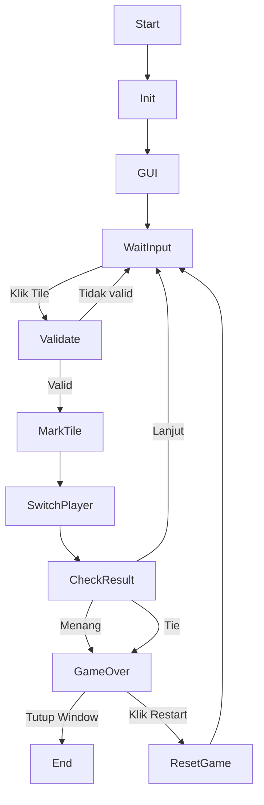

# Tugas Proyek Kelompok 3 Pengenalan Pemrograman Kelas A
Proyek kolaborasi python

# Anggota Kelompok
- **Kevin Rally Richardo Mintje** ([kevinm789](https://github.com/kevinm789))
- **Andin Putri Ramahdani** ([Dindintcuy0098](https://github.com/Dindintcuy0098))
- **Isak Samuel Stirman** ([samsam-07](https://github.com/samsam-07))

# Deskripsi Proyek
Membuat game Tic Tac Toe yang seru dengan tampilan yang menarik!!

# Cara Penggunaan
- Buka link repository yang di berikan, lalu salin kode dan buka di vscode
- Setelahnya, buat file baru di vscode dan masukan kode tersebut
- Save kode dengan menekan tombol ctrl+s
- Lalu run program (tidak harus mengetik program di terminal)
- Jika program gagal artinya belum mengunduh extensionnya, sehingga unduh extension 
terlebih dahulu
- Setelah tata cara 1-5 sudah selesai, run kembali program
- Jika berhasil maka tampilan akan seperti ini

# Flowchart

# Kontribusi Anggota Kelompok
| Nama Kontributor        | Persentase Kontribusi | Jumlah Kontribusi | Profil GitHub                              |
|------------------------|----------------------|-------------------|--------------------------------------------|
| Kevin               | 33,33%                  | 10                | [kevinm789](https://github.com/kevinm789)            |
| Andin                 | 33,33%                  | 10                 | [Dindintcuy0098](https://github.com/Dindintcuy0098)                 |
| Isak         | 33,33%                   | 10                 | [samsam-07](https://github.com/samsam-07)  |
